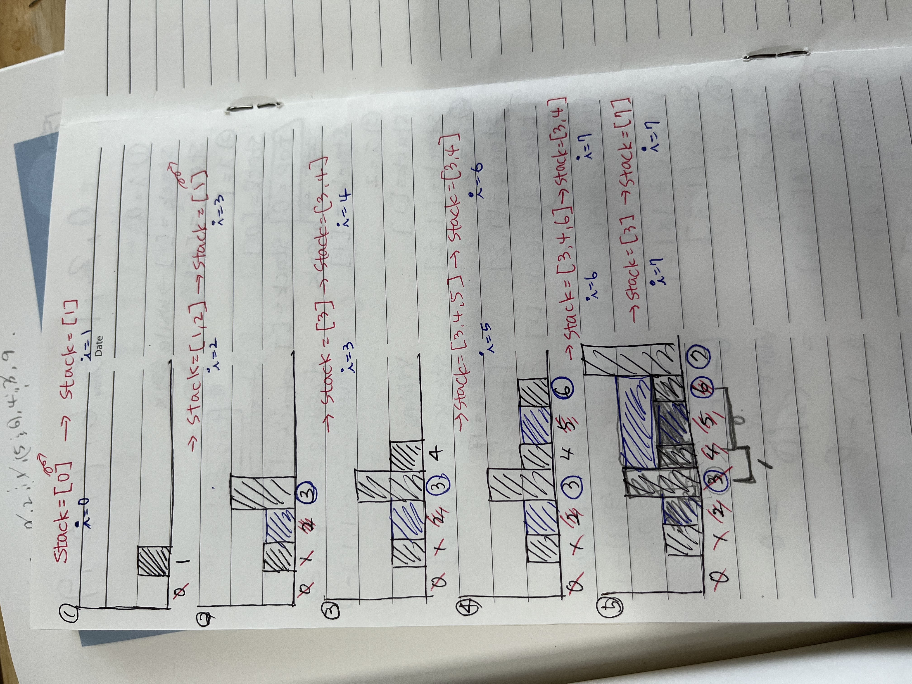

# 07 배열
: 배열은 값 또는 변수 엘리먼트의 집합으로 구성된 구조로, 하나 이상의 인덱스 또는 키로 식별된다.

자료구조 

- `메모리` 공간 기반의 연속 방식
    - `배열`: 크기를 지정하고 해당 크기만큼의 연속된 메모리 공간을 할당받는 작업을 수행하는 자료형, 어느 위치에나 O(1)에 조회가 가능하다는 장점이 있다.
        - `정적 배열`: 크기가 고정되어 있으며, 한번 생성한 배열은 크기를 변경하는 것이 불가능
        - `동적 배열`: 크기를 지정하지 않고 자동으로 리사이징하는 배열(파이썬의 `리스트`), 미리 초깃값을 작게 잡아 배열을 생성하고, 데이터가 추가되면서 꽉 채워지면, 늘려주고 모두 복사하는 식(대개는 `더블링` 방식)
- `포인터` 기반의 연결 방식
    - `연결 리스트`

---

## 07 [두수의 합](https://leetcode.com/problems/two-sum/)

덧셈하여 타겟을 만들 수 있는 배열의 두 숫자 **인덱스를 리턴**하라.

### 풀이1. 브루트 포스로 계산

브루트 포스: 배열을 2번 반복하면서 모든 조합을 더해서 일일이 확인해보는 무차별 대입 방식

마지막 요소들까지 모두 차례대로 비교해 가며 정답을 찾을 때까지 계속 진행한다. 시간 복잡도는 O(n^2)이다.

### 풀이2. in을 이용한 탐색

모든 조합을 비교하지 않고, 타겟에서 첫 번째 값을 뺀 값 target - n 이 존재하는지 탐색하는 문제로 변경해보자.

`enumerate()` : 반복문을 사용할 때 리스트의 순서값, 즉 인덱스의 정보가 필요한 경우가 있다. enumerate() 함수는 **리스트의 원소에 순서값을 부여해주는 함수**이다.

```python
item = ["First", "Second", "Third"]
for val in enumerate(item):
		print(val)

>>> (0, 'First')
		(1, 'Second')
		(2, 'Third')
```

시간 복잡도는 O(n).

### 풀이3. 첫 번째 수를 뺀 결과 키 조회

비교나 탐색 대신 한 번에 정답을 찾을 수 있는 방법.

### 풀이4. 조회 구조 개선

딕셔너리 저장과 조회를 2개의 for문으로 각각 처리했던 방식을 좀 더 개선해서 이번에는 하나의 for로 합쳐서 처리해보자.

*딕셔너리는 키 값을 조회함.

```python
dict1 = {
    "바늘": "실",
    "연필": "지우개",
    "라면": "볶음밥",
    "소풍": "김밥"
}
if "바늘" in dict1:
    print(True)
else:
    print(False)
>>> True

if "실" in dict1:
    print(True)
else:
    print(False)
>>> False
```

### 풀이5. 투 포인터 이용

(리스트가 오름차순으로 정렬되어 있다는 가정 하에 )왼쪽 포인터와 오른쪽 포인터의 합이 타겟보다 크다면 오른쪽 포인터를 왼쪽으로, 작다면 왼쪽 포인터를 오른쪽으로 옮기면서 값을 조정하는 방식이다.

---

## 08 [빗물 트래핑](https://leetcode.com/problems/trapping-rain-water/)

높이를 입력받아 비 온 후 얼마나 많은 물이 쌓일 수 있는지 계산하라.

### 풀이1. 투 포인터를 최대로 이동

왼쪽 포인터와 오른쪽 포인터가 최대 높이의 막대로 이동할 때까지, 각각 좌우 기둥 최대 높이 left_max, right_max 가 현재 높이와의 차이만큼 물 높이 volume을 더해 나간다.

좌우 어느 쪽이든 낮은 쪽은 높은 쪽을 향해서 포인터가 가운데로 점점 이동한다. 오른쪽이 크다면 left +=1로 왼쪽이 이동하고, 그렇지 않다면(즉 왼쪽이 크다면) right -=1 로 오른쪽이 이동한다. 이렇게 하면 가장 높이가 높은 막대, '최대' 지점에서 좌우 포인터가 서로 만나게 되며 O(n)에 풀이가 가능하다.

### 풀이2. 스택 쌓기

봐도 모르겠다..<br>

---

## 09 [세 수의 합](https://leetcode.com/problems/3sum/)

배열을 입력받아 합으로 0을 만들 수 있는 3개의 엘리먼트를 출력하라.

### 풀이 1. 브루트 포스로 계산

세 개의 포인터 i, j, k가 각각 이동하면서 i+j+k=0을 찾아낸다. 이 브루트 포스 풀이에는 중복된 값이 있을 수 있으므로 이 경우에는 continue로 건너뛰도록 처리한다.

1. 입력받은 배열을 정렬한다. (정렬의 시간복잡도는 O(nlogn))
2. for문) i, j, k (시간복잡도 O(n^3) → 타임아웃)
3. 각각 중복된 값은 건너뛰기(continue)


### 풀이 2. 투 포인터로 합 계산

1. 입력받은 배열을 정렬한다.
2. i를 축으로 하고, 중복된 값은 continue로 건너뜀
3. i를 축으로 left, right 두개의 포인터를 설정하고 간격을 좁혀가며 sum을 계산한다.
4. sum < 0 이면 값을 더 키워야 하므로 left를 오른쪽으로 이동하고, sum > 0 이면 값을 더 작게 하기 위해 right를 왼쪽으로 이동한다.
5. sum = 0 이면 정답이므로 결과를 리스트 변수 result에 추가한다. 
6. 정답을 추가한 후에는 left, right 양 옆에 동일한 값이 있을 수 있으므로 동일한 값이 있다면 left +=, right -=1 을 반복해서 스킵하도록 처리한다.
7. 마지막으로 left를 한 칸 우측으로, right를 한 칸 왼쪽으로 더 이동하고 다음으로 넘긴다.
    
    
    

---

## 10 [배열 파티션 Ⅰ](https://leetcode.com/problems/array-partition-i/)

n개의 페어를 이용한 min(a,b)의 합으로 만들 수 있는 가장 큰 수를 출력하라.

### 풀이1. 오름차순 풀이

min()을 합산했을 때 최대를 만드는 것은 결국 min()이 되도록 커야 한다는 뜻이고, 뒤에서부터 내림차순으로 집어넣으면 항상 최대 min() 페어를 유지할 수 있다.

정렬된 상태에서 앞에서부터 오름차순으로 인접 요소 페어를 만들면 가장 큰 a1과 a2 페어들을 만들 수 있고 이 페어들의 합이 곧 만들 수 있는 최대 합이 된다.

→ 정렬된 상태에서 앞에서부터 오름차순(또는 뒤에서부터 내림차순)으로 페어를 만들면 된다.

1. 입력받은 배열을 정렬한다.
2. for문) pair = [] 에 앞에서부터 요소를 추가해서, len(pair) == 2가 되면 sum에 더해주고, pair는 다시 []로 초기화한다.
3. sum을 리턴한다.

### 풀이2. 짝수 번째 값 계산

일일히 min() 값을 구하지 않아도 짝수 번째 값(0부터 시작하므로)을 더하면 될 것 같다. 정렬된 상태에서는 짝수 번째에 항상 작은 값이 위치하기 때문이다.

불필요한 리스트 변수를 생략할 수 있기 때문에, 전체 코드 또한 많이 줄어들어 매우 간결하게 구현할 수 있다.

---

## 11 [자신을 제외한 배열의 곱](https://leetcode.com/problems/product-of-array-except-self/)

배열을 입력받아 output[i]가 자신을 제외한 나머지 모든 요소의 곱셈 결과가 되도록 출력하라.

*나눗셈을 하지 않고 O(n)에 풀이하라.

### 풀이1. 왼쪽 곱셈 결과에 오른쪽 값을 차례대로 곱셈

자기 자신을 제외하고 왼쪽의 곱셈 결과와 오른쪽의 곱셈 결과를 곱해야 한다.

   

### 풀이2.

[[Question] 12. 각 원소가 자신을 제외한 나머지 원소들의 곱셈하기](https://bestcoding.tistory.com/36)

---

## 12 [주식을 사고팔기 가장 좋은 시점](https://leetcode.com/problems/best-time-to-buy-and-sell-stock/)

한 번의 거래로 낼 수 있는 최대 이익을 산출하라.

### 풀이1. 브루트 포스로 계산

→ O(n^2) 타임 아웃

### 풀이2. 저점과 현재 값과의 차이 계산

저점을 계속 최솟값으로 갱신해나가면서, 현재 값과 최솟값과의 차이를 계산해 만약 더 클 경우 최댓값 profit을 계속 갱신하면서 반복한다.

최댓값에는 가장 낮은 값을 초깃값으로 해야 어떤 값이든 최댓값이 교체될 수 있고 반대로 최솟값에는 가장 높은 값을 초깃값으로 해야 어떤 값이든 최솟값이 바로 교체될 수 있다.

→ `sys 모듈` 을 활용해 시스템이 지정할 수 있는 가장 높은 값, 낮은 값을 활용하자.

max = -sys.maxsize

min = sys.minsize