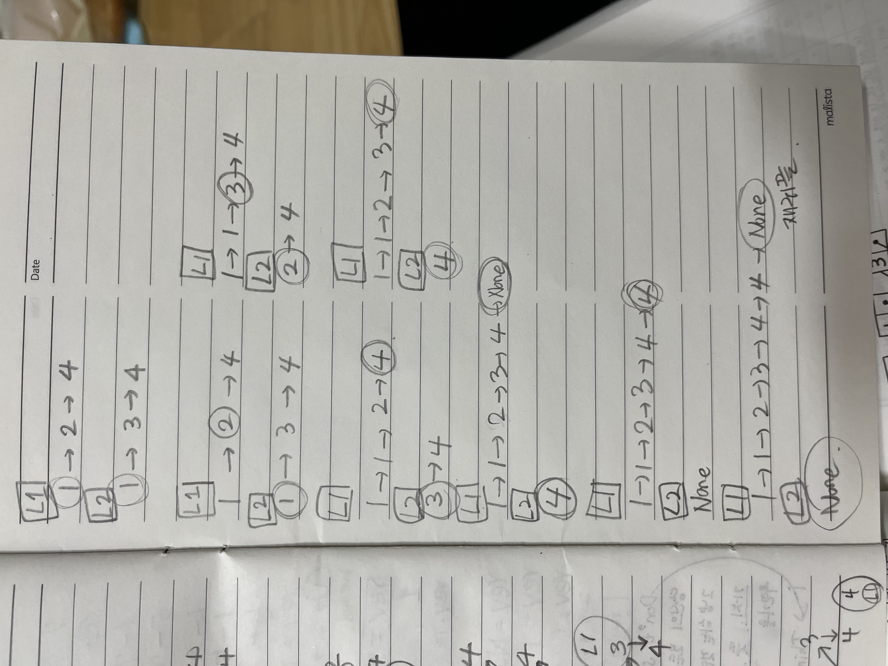
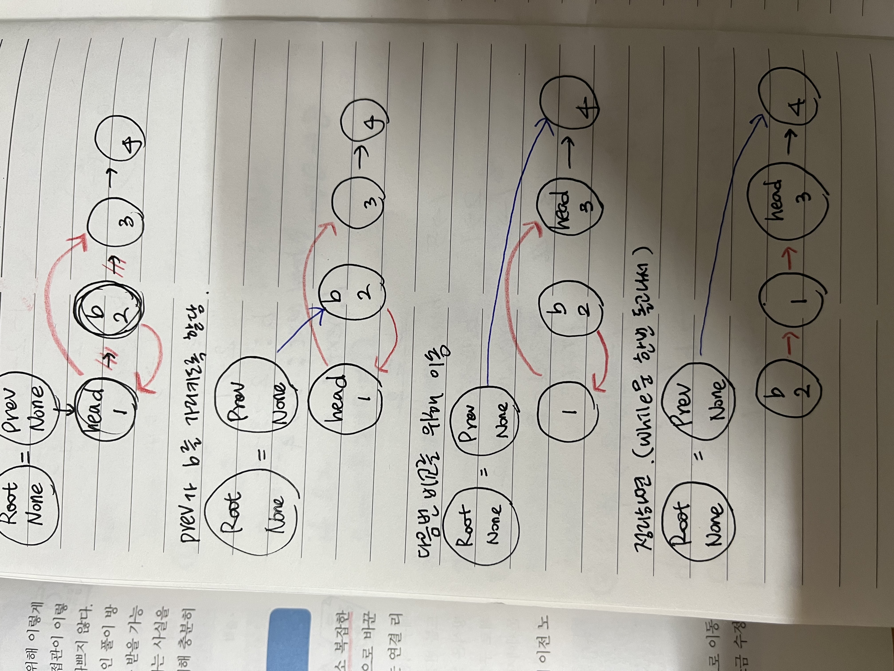

# 08 연결 리스트
: 연결 리스트는 데이터 요소의 선형 집합으로, 데이터의 순서가 메모리에 물리적인 순서대로 저장되지는 않는다.

연결 리스트는 컴퓨터과학에서 배열과 함께 가장 기본이 되는 대표적인 선형 자료구조 중 하나로 다양한 추상 자료형(ADT) 구현의 기반이 된다. 동적으로 **새로운 노드를 삽입하거나 삭제하기가 간편**하며, 연결 구조를 통해 물리 **메모리를 연속적으로 사용하지 않아도 되기 때문에 관리도 쉽다**. 또한 데이터를 구조체로 묶어서 포인터로 연결한다는 개념은 여러 가지 방법으로 다양하게 활용이 가능하다.

연결 리스트는 배열과 달리 특정 인덱스에 접근하기 위해서는 전체를 순서대로 읽어야 하므로 상수 시간에 접근할 수 없다. 즉 **탐색에는 O(n)이 소요**된다. 반면, **시작 또는 끝 지점에 아이템을 추가하거나 삭제, 추출하는 작업은 O(1)**에 가능하다.

---

## 13 [팰린드롬 연결 리스트](https://leetcode.com/problems/palindrome-linked-list/)

연결 리스트가 팰린드롬 구조인지 판별하라.

<aside>
💡 연결 리스트 클래스 구현 방법 숙지하기.

</aside>

```python
class ListNode:
		def __init__(self, val=0, next=None):
				self.val = val
				self.next = next
```

### 풀이1. 리스트 변환

앞뒤로 모두 추출할 수 있는 자료구조가 필요하다. 일반적인 스택 자료구조는 마지막 요소만 추추라는 연산만 있지만, 파이썬의 리스트는 `pop()` 함수에 인덱스를 지정할 수 있어 마지막 요소가 아니라도 얼마든지 원하는 위치를 자유롭게 추출할 수 있다. 이 문제는 연결 리스트를 파이썬의 리스트로 변환하여 리스트의 기능을 이용하면 쉽게 풀이할 수 있다.

### 풀이2. 데크를 이용한 최적화

`q.pop(0)` 에서 첫 번째 아이템을 추출할 때의 속도 문제다. 동적 배열로 구성된 리스트는 맨 앞 아이템을 가져오기에 적합한 자료형이 아니다. 왜냐하면 첫 번째 값을 꺼내오면 모든 값이 한 칸씩 시프팅되며, 시간 복잡도 O(n)이 발생하기 때문이다.

파이썬의 `데크(Deque)`는 **이중 연결 리스트 구조**로 **양쪽 방향 모두 추출하는 데 시간 복잡도 O(1)**에 실행된다.

데크 자료형을 선언하고 데크에서 제공하는 메소드(`popleft()`)로 비교한 것 외에 나머지 코드는 풀이1과 동일하다.

### 풀이4. 런너를 이용한 우아한 풀이

팰린드롬 연결 리스트 무제의 제대로 된 풀이법은 런너(Runner) 기법을 활용하는 것이다. 빠른 런너(2칸씩 이동)와 느린 런너(1칸씩 이동)를 각각 출발시키면, 빠른 런너가 끝에 다다를 때 느린 런너는 정확히 중간 지점에 도달할 것이다. 느린 런너는 중간까지 이동하면서 역순으로 연결 리스트 rev를 만들어 나간다. 중간에 도달한 느린 런너가 나머지 경로를 이동할 때, 역순으로 만든 연결 리스트의 값들과 일치하는지 확인해나가면 된다.

연결 리스트를 다른 자료형으로 변환하거나 편법을 사용하지 않고 그 자리에서 바로 풀이함으로써 좀 더 연결 리스트답게 우아한 방식으로 풀 수 있었다.

<aside>
💡 런너는 연결 리스트를 순회할 때 2개의 포인터를 동시에 사용하는 기법이다. 한 포인터가 다른 포인터보다 앞서게 하여 병합 지점이나 중간 위치, 길이 등을 판별할 때 유용하게 사용할 수 있다.

</aside>

→ 2개의 포인터는 각각 **빠른 런너**, **느린 런너**라고 부르는데, 대개 빠른 런너(포인터)는 두 칸씩 건너뛰고 느린 런너(포인터)는 한 칸씩 이동하게 한다. 이때 빠른 런너가 연결 리스트의 끝에 도달하면, 느린 런너는 정확히 연결 리스트의 중간 지점을 가리키게 된다. 이 같은 방식으로 **중간 위치를 찾아내면**, 여기서부터 **값을 비교하거나 뒤집기를 시도하는 등** 여러모로 활용할 수 있어 **연결 리스트 문제**에서는 반드시 쓰이는 기법이기도 하다.

<aside>
💡 다중 할당은 2개 이상의 값을 2개 이상의 변수에 동시에 할당하는 것을 말한다.
→ 파이썬 참조 공부
</aside>

---

## 14 [두 정렬 리스트의 병합](https://leetcode.com/problems/merge-two-sorted-lists/)

정렬되어 있는 두 연결 리스트를 합쳐라.

### 풀이1. 재귀 구조로 연결

여기서는, 정렬된 리스트라는 점이 중요하다.

1. l1과 l2의 값을 비교해 작은 값이 왼쪽에 오게하고,
2. next는 그 다음 값이 엮이도록 재귀 호출을 한다.

<aside>
💡 파이썬 연산자 우선순위 숙지! or 보다 and가 먼저 실행된다.

</aside>



---

## 15 [역순 연결 리스트](https://leetcode.com/problems/reverse-linked-list/)

연결 리스트를 뒤집어라.

### 풀이1. 재귀 구조로 뒤집기

다음 노드 next와 현재 노드 node를 파라미터로 지정한 함수를 계속해서 재귀 호출한다. 

node.next에는 이전 prev 리스트를 계속 연결해주면서 node가 None이 될 때까지 재귀 호출하면 마지막에는 백트래킹되면서 연결 리스트가 거꾸로 연결된다. 여기서 맨 처음에 리턴된 prev는 뒤집힌 연결 리스트의 첫 번째 노드가 된다.

### 풀이2. 반복 구조로 뒤집기

마찬가지로, [node.next](http://node.next)를 이전 prev 리스트로 계속 연결하면서 끝날 때까지 반복한다. node가 None이 될 때 prev는 뒤집힌 연결 리스트의 첫 번째 노드가 된다. next, node.next = node.next, prev 로 다중 할당하는 부분은 재귀나 반복 양쪽 모두 동일하다. 일부러 이름도 head가 node가 되도록 동일하게 맞춰봤다. 반복 풀이의 경우 prev에 node를, node에 next를 별도로 셋팅하며, 이를 이용해 node가 None이 될 때까지 계속 while 반복문을 돌게 된다.

→ 두 풀이 비슷한 속도이지만, 반복이 재귀에 비해 70% 수준의 메모리를 차지해 공간 복잡도는 좀 더 낮은 편이며, 실행 속도 또한 약간 더 빠른 편이다.

---

## 16 [두 수의 덧셈](https://leetcode.com/problems/add-two-numbers/)

역순으로 저장된 연결 리스트의 숫자를 더하라.

### 풀이1. 자료형 변환

l1 : (2→4→3) , l2: (5→6→4)

1. 먼저, 역순으로 된 연결 리스트를 뒤집는다.
    
    (3→4→2), (4→6→5)
    
2. 덧셈 연산을 위해 연결 리스트를 파이썬의 리스트로 변경한다.
    
    [3,4,2], [4,6,5]
    
3. `.join()` 으로 리스트 요소를 합치고 int로 변환 후, 덧셈 진행
    
    342 + 465 = 807
    
4. 최종 계산 결과를 연결 리스트로 변환

<aside>
💡 하나의 문장이 너무 길어서 한 줄에 표현하기 어렵거나 보기 좋게 두 줄 이상으로 나누고자 할 때는 `문장 끝에 역슬래시(\)` 를 넣음으로써 다음 줄에서 계속하여 문장을 이어갈 수 있다.

</aside>

```python
resultStr = int(''.join(str(e) for e in a)) + \
int(''.join(str(e) for e in b))
```

<aside>
💡 `.join()` 함수는 리스트의 문자열들을 합치는 역할을 하므로, 매개변수로 문자열을 줘야한다. 숫자는 str()로 변환해서 매개변수로 넣어야함.

</aside>

### 풀이2. 전가산기 구현

입력값 A와 B, 이전의 자리올림수(Carry in) 이렇게 3가지 입력으로 합(Sum)과 다음 자리올림수(Carry out) 여부를 결정한다.

연산 결과로 나머지를 취하고 몫은 자리올림수 형태로 올리는 전가산기의 전체적인 구조만 참고해 풀이해본다.

1. 먼저, 두 입력값의 합을 구한다. 두 입력값의 연산을 수행하고 자릿수가 넘어갈 경우에는 자리올림수를 설정한다.
2. 넘어간 자리올림수는 다음번 연산에 사용하고, 나머지는 값으로 취한다.
3. 이 값들을 연결 리스트로 만들어서 리턴한다.

<aside>
💡 `divmod()` 는 파이썬의 내장 함수로, 몫과 나머지로 구성된 튜플을 리턴한다. 즉 다음과 같이 (a // b, a % b)와 동일한 결과를 출력한다.

</aside>

```python
# 10을 3으로 나누면 몫은 3, 나머지는 1이 된다.
>>> divmod(10,3)
(3,1)
>>> (10//3, 10%3)
(3,1)
```
---

## 17 [페어의 노드 스왑](https://leetcode.com/problems/swap-nodes-in-pairs/)

연결 리스트를 입력받아 페어 단위로 스왑하라.(첫번째값↔두번째값, 세번째값↔네번째값, ..)

### 풀이1. 값만 교환

연결 리스트의 노드를 변경하는게 아닌, 노드 구조는 그대로 유지하되 값만 변경하는 방법이다.

대개 연결 리스트는 복잡한 여러 가지 값들의 구조체로 구성되어 있고, 사실상 값만 바꾸는 것은 매우 어려운 일이다. 그러나 이 문제에서는 단 하나의 값으로 구성된 단순한 연결 리스트이고, 값을 바꾸는 정도는 어렵지 않게 가능하다. 변칙적인 풀이 방법이므로 빨리 풀기 위해 시도하는 방법이라는 사실을 알고, 반복 풀이에 대해 알고 있어야한다.

### 풀이2. 반복 구조로 스왑

단순히 값을 바꾸는 일에 비해 연결 리스트 자체를 바꾸는 일은 생각보다 다소 복잡한 문제다.



<aside>
💡 더미 노드에 대해서 알아볼 것

</aside>

### 풀이3. 재귀 구조로 스왑

재귀로는 훨씬 더 깔끔하게 풀이할 수 있다.

→ 어려워 ㅜㅜㅜㅜㅜ 나중에 한번 더 보기

### 풀이4. 내 풀이(재귀)

입력이 1→2→3→4 일 때,

1. p는 head의 다음 값으로 지정
    
    p = head.next
    
2. head는 p의 다음을 가리킴
    
    [head.next](http://head.next) = p.next
    
3. p는 head를 가리킴
    
    [p.next](http://p.next) = head
    

⇒  결과: 2(p)→ 1(head) → 3→ 4

1. head는 head의 다음 값을 가리킴 (재귀 호출) // 2 → 1 → 3(head) → 4
    
    [head.next](http://head.next) = swapPairs(head.next)
    
2. p를 리턴한다.

만약, 입력으로 들어온 노드의 개수가 홀수일 때는 (ex)1→2→3 ⇒ 1→2→3(head) 

head를 리턴한다. (그래야 마지막 결과값에 맨 뒤의 노드까지 붙어서 나옴)


---

## 18 [홀짝 연결 리스트](https://leetcode.com/problems/odd-even-linked-list/)

연결 리스트를 홀수 노드 다음에 짝수 노드가 오도록 재구성하라. 공간 복잡도 O(1), 시간 복잡도 O(n)에 풀이하라.

→ 이런 문제는 제약이 없을 경우 연결 리스트를 리스트로 바꾸고 파이썬 리스트가 제공하는 슬라이싱과 같은 다양한 함수를 사용하면 좀 더 쉽고 직관적이며 또한 빠르게 풀 수 있다.

### 풀이 1. 반복 구조로 홀짝 노드 처리

홀수 노드 다음에 짝수 노드가 오게 재구성하라고 했으니 홀, 짝 각 노드를 구성한 다음 홀수 노드의 마지막을 짝수 노드의 처음과 이어주면 된다.

→ 다중 할당 주의!!

---

## 19 [역순 연결 리스트 Ⅱ](https://leetcode.com/problems/reverse-linked-list-ii/)

인덱스 m에서 n까지를 역순으로 만들어라. 인덱스 m은 1부터 시작한다.

### 풀이 1. 반복 구조로 노드 뒤집기

start와 end를 기준으로 (right-left)만큼 반복하면서 역순으로 뒤집는다.