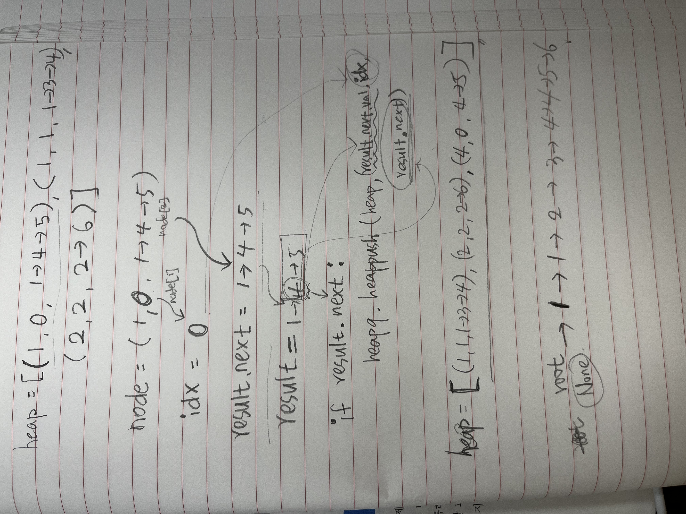

# 10 데크, 우선순위 큐

`데크`: 스택과 큐의 연산을 모두 갖고 있는 복합 자료형. 더블 엔디드 큐(Double-Ended Queue)의 줄임말로, 글자 그대로 양쪽 끝을 모두 추출할 수 있는, 큐를 일반화한 형태의 추상 자료형(ADT)이다.

- 데크는 양쪽에서 삭제와 삽입 모두 가능(스택과 큐의 특징 모두 갖고 있음)
- 이중 연결 리스트로 구현하는 것이 가장 잘 어울린다. (양쪽으로 head와 tail이라는 이름의 두 포인터)

`우선순위 큐`: 우선순위 큐는 큐 또는 스택과 같은 추상 자료형과 유사하지만 추가로 각 요소의 '우선순위'와 연관되어 있다. 우선순위 큐는 어떠한 특정 조건에 따라 우선순위가 가장 높은 요소가 추출되는 자료형이다.

- 정렬 알고리즘을 사용하면 우선순위 큐를 만들 수 있다.
- 힙과 관련이 깊다.(heapq 모듈 활용)

## 26 [원형 데크 디자인](https://leetcode.com/problems/design-circular-deque/)

다음 연산을 제공하는 원형 데크를 디자인하라.

MyCircularDeque(k): 데크 사이즈를 k로 지정하는 생성자다.

insertFront(): 데크 처음에 아이템을 추가하고 성공할 경우 true를 리턴한다.

insertLast(): 데크 마지막에 아이템을 추가하고 성공할 경우 true를 리턴한다.

deleteFront(): 데크 처음에 아이템을 삭제하고 성공할 경우 true를 리턴한다.

deleteLast(): 데크 마지막에 아이템을 삭제하고 성공할 경우 true를 리턴한다.

getFront(): 데크의 첫 번째 아이템을 가져온다. 데크가 비어 있다면 -1을 리턴한다.

getRear(): 데크의 마지막 아이템을 가져온다. 데크가 비어 있다면 -1을 리턴한다.

isEmpty(): 데크가 비어 있는지 여부를 판별한다.

isFull(): 데크가 가득 차 있는지 여부를 판별한다.

### 풀이 1. 이중 연결 리스트를 이용한 데크 구현

`데크`란 앞서 설명에서 언급했듯이 **양쪽 끝을 모두 추출할 수 있는 큐**를 말한다.

왼쪽, 오른쪽 인덱스 역할을 하는 head, tail을 정의하고, 최대 길이 정보를 k로 설정한다.

여기에 추가로, 현재 길이 정보를 담는 변수가 될 len을 self.len = 0으로 따로 정의해둔다.

---

## 27 [k개 정렬 리스트 병합](https://leetcode.com/problems/merge-k-sorted-lists/)

k개의 정렬된 리스트를 1개의 정렬된 리스트로 병합하라.

### 풀이 1. 우선순위 큐를 이용한 리스트 병합

파이썬의 heapq 모듈은 최소 힙(Min Heap)을 지원하며, lst.val이 작은 순서대로 pop()할 수 있다.

heappop()으로 값을 추출하면 가장 작은 노드의 연결 리스트부터 차례대로 나오게 된다. 이 값을 결과가 될 노드 result에 하나씩 추가한다. 힙에 아무 값도 남지 않을 때까지 반복하면 result에는 작은 노드부터 차례대로 연결된다.

<aside>
💡 heapq 모듈, 함수 알기

</aside>

