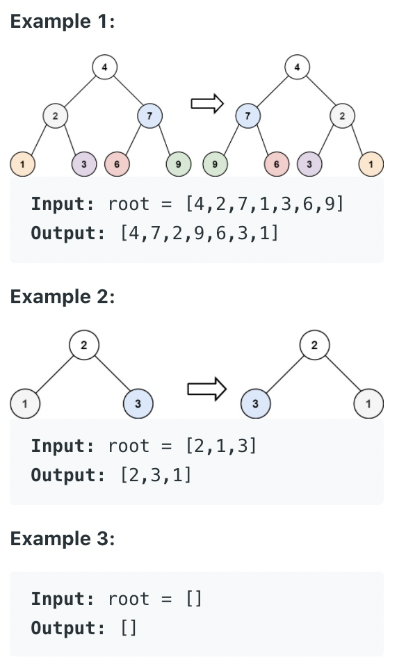

# 14 트리

`트리`는 계층형 트리 구조를 시뮬레이션 하는 추상 자료형(ADT)으로, 루트 값과 부모-자식 관계의 서브트리로 구성되며, 서로 연결된 노드의 집합이다.

트리의 속성

- 재귀로 정의된 자기 참조 자료구조(트리는 자식도 트리고 또 그 자식도 트리다. → 서브트리로 구성된다고 표현)
- 트리는 항상 단방향이다.

> 트리의 각 명칭
> 

트리는 항상 `루트(Root)` 에서부터 시작된다. 루트는 `자식(Child)` 노드를 가지며, `간선(Edge)` 으로 연결되어 있다. 자식 노드의 개수는 `차수(Degree)` 라고 하며, `크기(Size)` 는 자신을 포함한 모든 자식 노드의 개수다. `높이(Height)` 는 현재 위치에서부터 `리프(Leaf)` 까지의 거리, `깊이(Deapth)` 는 루트에서부터 현재 노드까지의 거리다. `레벨(level)` 은 0에서부터 시작한다.

> 그래프 vs 트리
> 

그래프와 트리의 차이점

트리는 **순환 구조**를 갖지 않느 그래프다. 트리는 어떠한 경우에도 한번 연결된 노드가 다시 연결되는 법이 없다. 트리는 부모 노드에서 자식 노드를 가리키는 단방향뿐이다. 트리는 하나의 부모 노드를 갖는다는 차이점이 있으며 루트 또한 하나여야 한다.

> 이진 트리
> 

각 노드가 2개 이하의 자식을 가질 경우(모든 노드의 차수가 2 이하) 이진 트리라고 한다. 이진 트리는 왼쪽, 오른쪽, 최대 2개의 자식을 갖는 매우 단순한 형태이다.

- 정 이진 트리(Full Binary Tree): 모든 노드가 0개 또는 2개의 자식을 갖는다.
- 완전 이진 트리(Complete Binary Tree): 마지막 레벨을 제외하고 모든 레벨이 완전히 채워져 있으며, 마지막 레벨의 모든 노드는 가장 왼쪽부터 채워져 있다.
- 포화 이진 트리(Perfect Binary Tree): 모든 노드가 2개의 자식 노드를 갖고 있으며, 모든 리프 노드가 동일한 깊이 또는 레벨을 갖는다. 문자 그대로, 가장 완벽한 유형의 트리다.

---

## 42 [이진 트리의 최대 깊이](https://leetcode.com/problems/maximum-depth-of-binary-tree/)

이진 트리의 최대 깊이를 구하라. 

### 풀이1. 반복 구조로 BFS 풀이
BFS는 큐 사용. deque 선언

---

## 43 [이진 트리의 직경](https://leetcode.com/problems/diameter-of-binary-tree/)

이진 트리에서 두 노드 간 가장 긴 경로의 길이를 출력하라.

### 풀이1. 상태값 누적 트리 DFS

가장 긴 경로를 찾는 방법은 먼저 가장 말단, 즉 리프 노드까지 탐색한 다음 부모로 거슬러 올라가면서 각각의 거리를 계산해 상태값을 업데이트하면서 누적해 나가면 된다.

---

## 44 [가장 긴 동일 값의 경로](https://leetcode.com/problems/longest-univalue-path/)

동일한 값을 지닌 가장 긴 경로를 찾아라.

### 풀이1. 상태값 거리 계산 DFS

트리의 말단, 리프 노드까지 DFS로 탐색해 내려간 다음, 값이 일치할 경우 다음과 같이 거리를 차곡차곡 쌓아 올려가며 백트래킹하는 형태로 풀이할 수 있다.

왼쪽과 오른쪽 자식 노드를 각각 확인해서 현재 노드, 그러니까 부모 노드와 동일한 경우 각각 거리를 1 증가한다.

합이 가장 큰 값을 최종 결과로 한다. 이제 다음번 백트래킹 시 계산을 위해 앞서 문제와 유사하게 상태값을 셋팅해서 부모 노드로 올려야 한다.

---

## 45 [이진 트리 반전](https://leetcode.com/problems/invert-binary-tree/)

중앙을 기준으로 이진 트리를 반전시켜라.

### 풀이1. 파이썬다운 방식

오른쪽부터 재귀 탐색을 진행한다.

가장 말단, 리프 노드까지 내려가서 백트래킹하면서 스왑하는 상향(Bottom-Up) 방식이다.

### 풀이2. 반복 구조로 BFS

자유롭게 스왑하면서 queue에 추가한다. 먼저 삽입된 노드는 반복 구조로 계속 스왑되면서 자식 노드가 계속해서 큐에 추가되는 구조가 된다.

부모 노드부터 스왑하면서 계속 아래로 내려가는 하향(Top-Down) 방식 풀이라 할 수 있다.

### 풀이3. 반복 구조로 DFS(전위 순회)

BFS로 탐색할 때는 popleft()로 처음 값을 추출하고, 여기서 DFS로 탐색할 때는 pop()으로 마지막 값을 추출한다.

### 풀이4. 반복 구조로 DFS(후위 순회)

스왑 위치만 다를 뿐 풀이3과 다르다.