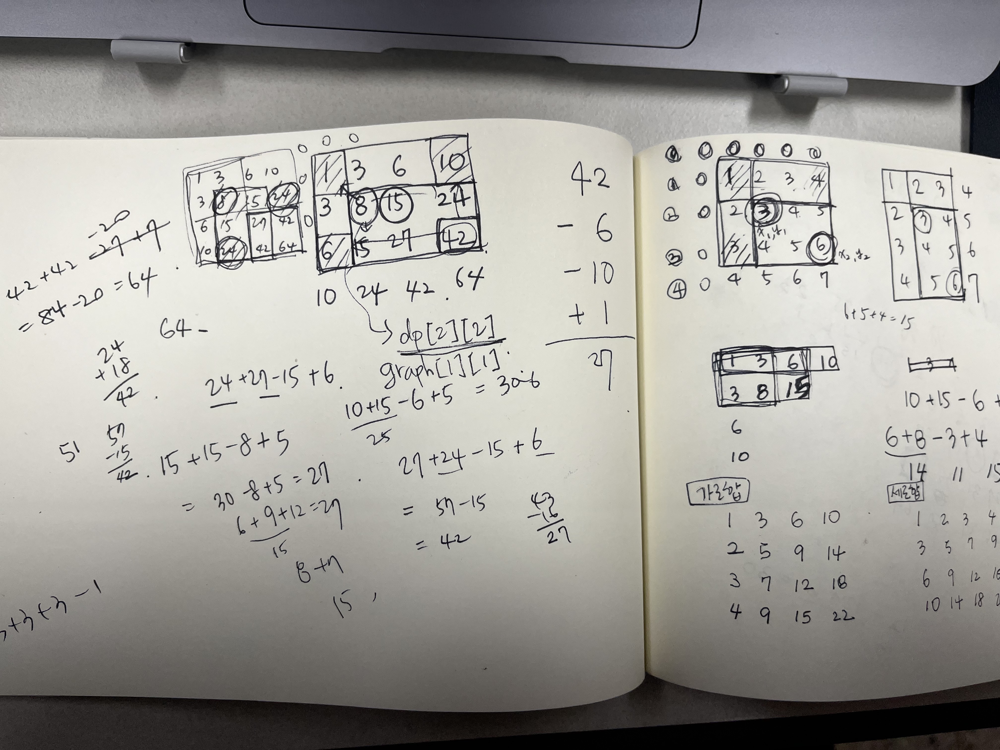

# 문제 풀이

## [2606. 바이러스](https://www.acmicpc.net/problem/2606)

### dfs 풀이

1. 필요한 변수 입력받기
2. 컴퓨터 번호 쌍 그래프 생성 
    
    → `collections.defaultdict(list)`
    
    - 양방향이므로 양쪽 인덱스에 append 해줄 것
3. 방문 노드를 담을 배열 visited 생성
    - 노드가 1부터 시작이므로 인덱스를 맞춰주기 위해 배열 크기는 n+1로 생성
4. dfs(v) # v는 방문 노드
    1. 노드 v에 대해 방문 처리
    2. 노드 v와 인접한 노드들을 for문으로 돌면서 방문하지 않은 노드가 있다면 재귀 호출
    3. 방문 노드 배열에서 True를 count 한 값 - 1(1번 컴퓨터 제외)을 리턴

---

## [2775. 부녀회장이 될테야](https://www.acmicpc.net/problem/2775)

### 재귀 풀이

1. 0층의 n호는 n명이 거주하고 있으므로, k = 0일 때는 n을 리턴
2. k-1층의 1호부터 n호까지의 재귀를 호출하면서 result에 더해 리턴한다.

→ 시간 초과

### 배열 풀이

1. 배열의 이전 인덱스 값을 다음 인덱스 값에 더해 가면서 배열의 값을 업데이트 시킨다.

---

## [18870. 좌표 압축](https://www.acmicpc.net/problem/18870)

- 한 줄에 여러 변수 입력받기

→ `list(map(int, input().split()))` // 리스트로 출력됨

- 딕셔너리 컴프리헨션
- 아스테리스크(*) 언패킹: 리스트에서 각 요소의 값만 출력하고 싶을 때

```python
>>> fruits = ['lemon', 'pear', 'watermelon', 'tomato']
>>> fruits
['lemon', 'peer', 'watermelon', 'tomato']
>>> print(*fruits)
lemon pear watermelon tomato
```

---

## [18258. 큐 2](https://www.acmicpc.net/problem/18258)

- 음수, 0, 양수, 최솟값, 최댓값 → 반드시 확인해 볼 엣지케이스 명심!!
    
    (한 자리수, 두 자리수, 세 자리수 .. 도 함께 확인하기)
    
- 처음에 `q.append(command[-1])`로 코드를 짰기 때문에 정수가 두자리 수 이상일 때는 처리가 안됐음..
- command 자체를 split()해서 받아올 것.

---

## [7568. 덩치](https://www.acmicpc.net/problem/7568)

음,, 어떻게든 풀어보려고 이렇게 저렇게 생쇼를 했다. 

- 중복순위를 어떻게 정렬해야하는지에 대한 고민을 많이 했다.
- 그냥 2중 for문을 돌려서 rank를 증가시키면서 파악하고 출력하면 되는 문제였다..

---

## [11718. 그대로 출력하기](https://www.acmicpc.net/problem/11718)

Point: 입력값이 몇 번 주어지는지 알 수 없는 상태에서 입력된 값 그대로 출력하기 

- `try ~ except` 를 사용
    
    → `EOFError` 예외 처리 (End Of File: 입력값이 들어오지 않는 상태)
- `import sys` 입력 가속해서 하면 출력 초과가 뜨는데 왜 그런지 모르겠다..
  
---

## [1806. 부분합](https://www.acmicpc.net/problem/1806)

반나절의 삽질 끝에,, 다른 풀이를 참고하여 성공했다.

- “연속된 수들”의 부분합이므로 수열 리스트를 정렬하면 안된다. → 문제를 정확하게 잘 읽자.
- 시간을 조금이라도 줄이기 위해, 맨 처음 수열의 전체 합이 s보다 작으면 0을 리턴하도록 했다.
- 투 포인터를 사용하는데, strat와 end 모두 0에서 시작시킨다.
- length를 최솟값으로 업데이트 시키기 위해, length는 입력의 최대값(100,000) +1 을 하여 100,001로 선언한다.
- total ≥ s 인 경우,
    
    → length는 현재의 length값과 end-start (끝 인덱스에서 시작 인덱스를 뺀 값) 중 작은 값으로 업데이트한다.
    
    → total에서 start 인덱스의 값을 빼주고, start는 1 증가시킨다.
    
- total < s인 경우,
    
    → end가 끝까지 가면, start를 증가시켜도 total값은 더 줄어드므로(앞의 값을 빼주니까) 바로 반복문을 탈출시킨다.
    
    → total에 end 인덱스의 값을 더해주고, end는 1 증가시킨다.
    
- length가 100,001이 아닌 경우 length를 리턴하고, 그 외의 경우엔 0을 리턴한다.

---

## [1920.수 찾기](https://www.acmicpc.net/problem/1920)

a와 b를 list로 받으면 시간초과가 나지만, a를 set으로 b는 그냥 map타입으로 하면 성공한다.

- List의 in 연산자의 시간 복잡도는 O(N)
- Set과 Dictionary의 in 연산자의 시간 복잡도는 O(1)

---

## [11286.절댓값 힙](https://www.acmicpc.net/problem/11286)

heap에 [절댓값, 입력값] 형태로 요소를 추가해주면, 절댓값이 작은 순서로 정렬된다. 출력할 때는 `heapq.heappop(heap)[1]` 로 입력값만 출력하면 된다.

---

## [1644.소수의 연속합](https://www.acmicpc.net/problem/1644)

BOJ 2581.소수 풀이를 참고하여 (set으로 에라토네스의 체 구현) 풀었는데, 메모리 초과가 뜸.

이유를 잘 모르겠다,, → 소수 리스트를 만들고 append 하는 방식으로 풀었더니 통과함.

---

## [1193.분수찾기](https://www.acmicpc.net/problem/1193)

수학적 규칙을 찾아서 공식을 잘 세워야함. 대각선의 규칙과 분모-분자 간의 규칙.

---

## [🥉𝟮 - 2231.분해합](https://www.acmicpc.net/problem/2231)

num = [0] * 1000001인 리스트를 만들고, 각 인덱스에 분해합을 저장하는 방식으로 했더니 시간초과 ㅎㅎ;

→ 리스트를 만들 필요없이 for문을 돌면서 변수 하나에 분해합을 저장하고, 입력값과 같으면 바로 리턴하고 for문을 다 돌면 분해합이 없다는 것이므로 0을 리턴한다.

---

## [🥈Ⅲ - 1463.1로 만들기](https://www.acmicpc.net/problem/1463)

- 3가지 연산을 진행했을 때, 가장 최솟값을 저장해야함.
- 이전 수에 대해서 연산 횟수를 미리 저장해둠.
- 연산 횟수를 증가시켜야 하므로 +1 하는 것 잊지말기.
- 인덱스 번호는 해당 정수를 의미함.

---

## [🥈Ⅴ - 1436.영화감독 숌](https://www.acmicpc.net/problem/1436)

처음에는 str(num).count(’6’) ≥ 3 으로 작성했는데, 문제를 다시 제대로 읽어보니 6이 **연속**으로 3개 이상이어야 한다. → 문제를 잘‼️ 읽자

- num = 665부터 시작해서 1씩 수를 증가시켜주고, str타입으로 변환했을 때 ‘666’이 들어있으면 n을 감소시키는 while문을 돌렸다.
- 마지막에 num을 출력해주면 된다.

---

## [🥈Ⅱ - 1912.연속합](https://www.acmicpc.net/problem/1912)

이중 for문으로 슬라이싱해서 모든 경우의 수를 탐색하는 코드를 짰더니 시간초과 → 시간복잡도 O(n^2)

이 문제는 DP로 풀어야한다. → 시간복잡도 O(n)

- 현재 값과 이전 값까지의 합 중 큰 값으로 업데이트한다.
- dp 배열 중 가장 큰 값을 출력한다.

*DP문제는 수열이 주어졌을 때, **규칙**을 찾고 수열의 크기와 **같은 크기의 DP 배열**이 필요하다.

---

## [🥈Ⅲ - 1966.프린터 큐](https://www.acmicpc.net/problem/1966)

처음 풀이는 런타임에러가 났는데, 확실히는 모르겠지만 top = max(priority) 의 top 변수 때문에 난 것 같다.

- 순서를 담을 인덱스 리스트를 만들고, `zip()` 을 이용해서 (우선순위, 인덱스) 값들이 담길 deque를 만들었다.
- target 문서를 target = (priority[m], m) 변수에 담아주고
- target 문서가 deque에 남아있는 동안 while문을 돌려준다.
- if: 맨 처음 문서의 우선순위가 가장 높다면, `popleft()` 를 해주고, cnt(출력 순서)를 +1 증가시킨다. 그리고 우선순위가 담겨있는 배열priority에서 max값을 `remove()` 함수를 이용하여 제거한다.
    
    → 여기서 알아야 할 점은 `리스트.remove(값)` 은 리스트에 동일한 값을 가진 동일한 요소들이 있더라도 리스트에서 **가장 먼저 발견된 요소 1개를 지워준다**는 것
    
    ```python
    idx = [1, 2, 3, 1]
    idx.remove(1)
    # idx = [2, 3, 1]
    ```
    
- else: `popleft()`한 값을 `append()`해서 맨 뒤에 다시 붙여준다.
- 마지막에 출력 순서 cnt를 출력해준다.

---

## [🥈Ⅲ - 4779.칸토어 집합](https://www.acmicpc.net/problem/4779)

재귀로 푸는 분할 정복 문제

- 재귀는 가장 작은 문제의 답과 패턴을 잘 이해하면 쉽게 풀 수 있는 것 같다.
- 입력 개수를 모를 때, 입력 받아오기
    
    ```python
    # 1. EOFError 처리
    while True:
    	try:
    		n = int(input())	
    		print(cantor(n))		
    	except EOFError:
    		break
    
    # 2. 표준 입력 -> 1번보다 2가 나은듯
    for n in map(int, sys.stdin):
    	print(cantor(n))
    ```

---

## [🥈Ⅳ - 2217.로프](https://www.acmicpc.net/problem/2217)

수학 문제

- 최대 중량이 가장 작은 로프의 중량 * 연결된 로프의 개수 = 물체의 최대 중량
- 로프의 중량을 내림차순으로 정렬한다. (가장 큰 중량이 맨 앞에)
- ropes = [100, 80, 60, 40, 20] 이라면, w = [100*1, 80*2, 60*3, 40*4, 20*5] 이다.
- w의 max값이 답이 된다.

---

## [🥈Ⅲ - 9095.1, 2, 3 더하기](https://www.acmicpc.net/problem/9095)

dp 문제

- 주어지는 입력 n이 11보다 작은 양수이므로 크기 11의 dp배열을 생성함.
- dp[1] = 1 → 1 /  dp[2] = 2 → 1+1, 2 / dp[3] = 4 → 1+1+1, 1+2, 2+1, 3
- dp[4]는 **1**에 3을 더하거나, **2**에 2를 더하거나, **3**에 1을 더하면 만들 수 있다.
    
    → 여기서 **1**을 만드는 방법의 수 = dp[1], **2**를 만드는 방법의 수 = dp[2], **3**을 만드는 방법의 수 = dp[3]이다. 각각의 방법의 수에 3을 더하고, 2를 더하고, 1을 더하면 4를 만드는 방법의 수가 전부 나오는 것!
    
    
    | dp[1] | 1 | 1 +3 |
    | --- | --- | --- |
    | dp[2] | 1+1, 2 | 1+1 +2, 2 +2 |
    | dp[3] | 1+1+1, 1+2, 2+1, 3 | 1+1+1 +1, 1+2 +1, 3 +1 |
- 즉, 4를 만드는 방법의 수 = dp[4] = dp[1] + dp[2] + dp[3] 이다.
- 같은 방식으로, 5는 4에 1을 더하거나 3에 2를 더하거나 2에 3을 더하면 된다. → dp[5] = dp[4] + dp[3] + dp[2]
- 이를 일반화시키면, **dp[n] = dp[n-1] + dp[n-2] + dp[n-3]**

---

## [🥈Ⅰ - 10844.쉬운 계단 수](https://www.acmicpc.net/problem/10844)

dp 문제

- dp 문제를 풀 때 **2차원 배열**을 활용할 수 있다는 점 생각하기
- dp[x][y] 는 x번째 자리 수에 숫자 y가 올 수 있는 경우의 수 이다.
- dp[1] =[0, 1, 1, 1, 1, 1, 1, 1, 1, 1]
    
    0은 첫번째 자리에 올 수 없으므로 dp[1][0] = 0이고, 나머지 숫자 1~9는 한 번씩 올 수 있으므로 1의 값이 들어간다.
    
- 앞자리 수가 0인 경우 그 뒤의 숫자는 1만 올 수 있다.
- 앞자리 수가 9인 경우 그 뒤의 숫자는 8만 올 수 있다.
- 앞자리 수가 2~8인 경우 그 뒤의 숫자는 자기 자신 -1, 자기 자신 +1 인 숫자 2가지가 올 수 있다.

| 숫자 | 첫 번째 자리(dp[1]) | 두 번째 자리(dp[2]) | 예시 |
| --- | --- | --- | --- |
| 0 | 0 | 1 = dp[1][1] | 10 |
| 1 | 1 | 1 = dp[1][0] + dp[1][2] | 21 |
| 2 | 1 | 2 = dp[1][1] + dp[1][3] | 12, 32 |
| 3 | 1 | 2 = dp[1][2] + dp[1][4] | 23, 43 |
| 4 | 1 | 2 = dp[1][3] + dp[1][5] | 34, 54 |
| 5 | 1 | 2 = dp[1][4] + dp[1][6] | 45, 65 |
| 6 | 1 | 2 = dp[1][5] + dp[1][7] | 56, 76 |
| 7 | 1 | 2 = dp[1][6] + dp[1][8] | 67, 87 |
| 8 | 1 | 2 = dp[1][7] + dp[1][9] | 78, 98 |
| 9 | 1 | 1 = dp[1][8] | 89 |

---

## [🥇Ⅴ - 1011.Fly me to theAlpha Centauri](https://www.acmicpc.net/problem/1011)

dp문제인가?했는데 규칙을 발견해야하는 수학 문제였음.

노트에 직접 써가면서 규칙을 발견해야하는데 규칙을 발견하기 생각보다 어려움.

| 거리(이동의 합) | 이동 | 이동 횟수(이동의 개수) |  |
| --- | --- | --- | --- |
| 1 | 1 | 1 | 1 = 1*1 |
| 2 | 1 1 | 2 | 2 = 1*2 |
| 3 | 1 1 1 | 3 |  |
| 4 | 1 2 1 | 3 | 4 = 2*2 |
| 5 | 1 2 1 1 | 4 |  |
| 6 | 1 2 2 1 | 4 | 6 = 2*3 |
| 7 | 1 2 2 1 1 | 5 |  |
| 8 | 1 2 2 2 1 | 5 |  |
| 9 | 1 2 3 2 1 | 5 | 9 = 3*3 |
| 10 | 1 2 3 2 1 1 | 6 |  |
| 11 | 1 2 3 2 2 1 | 6 |  |
| 12 | 1 2 3 3 2 1 | 6 | 12 = 3*4 |
| 13 | 1 2 3 3 2 1 1 | 7 |  |
| 14 | 1 2 3 3 2 2 1 | 7 |  |
| 15 | 1 2 3 3 3 2 1 | 7 |  |
| 16 | 1 2 3 4 3 2 1 | 7 | 16 = 4*4 |
| 17 | 1 2 3 4 3 2 1 1 | 8 |  |
| 18 | 1 2 3 4 3 2 2 1 | 8 |  |
| 19 | 1 2 3 4 3 3 2 1 | 8 |  |
| 20 | 1 2 3 4 4 3 2 1 | 8 | 20 = 4*5 |
| 21 | 1 2 3 4 4 3 2 1 1  | 9 |  |
- 이동 횟수는 [**1**, **2**], [3, **3**, 4, **4**], [5, 5, **5**, 6, 6, **6**], [7, 7, 7, **7,** 8, 8, 8, **8**] .. 의 규칙으로 나타난다.
- 2, 4, 6, 8, .. 을 기준으로 나타나는 이동횟수의 카운트가 증가한다. (2, 4, 6, 8, ... 이 다음 대괄호 묶음으로 넘어가기 직전까지를 나타냄)
- **각 묶음에서** 묶음 내에 존재하는 제곱수(n*n)보다 작거나 같으면 `이동 횟수 = n + (n-1)` 이고, 제곱수보다 크면 `이동 횟수 = n + n` 이다.

> 참고

[백준 1011번 파이썬 풀이: Fly me to the Alpha Centauri](https://yoonsang-it.tistory.com/28)

---

## [🥈Ⅲ - 1699.제곱수의 합](https://www.acmicpc.net/problem/1699)

어려운 dp문제.. 규칙을 찾기 너무 어려웠다ㅜㅜ 결국 블로그 참고해서 이해함!

- 맨 **처음** dp 배열은 크기 n, 각 인덱스는 주어진 수를 나타내고 각 값은 **최대항의 개수(1^2을 이용해서 최대로 표현한 개수)**를 나타낸다.
    
    → dp[n] = n 으로 초기화
    
- 자기 자신보다 작은 제곱수(i-제곱수)를 빼준 값과 현재의 dp[i]값과 비교하여 제곱수를 빼준 값이 더 작으면 dp[i]를 작은 값으로 업데이트 해준다.
    
    → dp[n]은 어떤 자연수 n을 제곱수의 합으로 나타낼 때 항의 최소 개수이다.
    
- `dp[i - j * j] + 1` 에서 +1을 해주는 이유는 제곱수 1개 항을 추가로 붙여줘야하기 때문임.
    - dp[4]
        
        = dp[4 - 2*2] + 1 = dp[0] + 1 = 0 + 1 = 1
        
    - dp[13]
        
        = dp[13 - 1*1] + 1 = dp[12] + 1 = 3 + 1 = 4
        
        = dp[13 - 2*2] + 1 = dp[9] + 1 = 1 + 1 = 2
        
        = dp[13 - 3*3] + 1 = dp[4] + 1 = 1 + 1 = 2

> 참고

[https://lakelouise.tistory.com/61](https://lakelouise.tistory.com/61)

[https://chanhuiseok.github.io/posts/baek-10/](https://chanhuiseok.github.io/posts/baek-10/)

---

## [🥇Ⅴ - 5430.AC](https://www.acmicpc.net/problem/5430)

어려운 문제는 아니지만, 시간초과와 반례를 찾느라 시간이 좀 걸렸음. (+입,출력이 특이함)

- R이 들어올 때마다 reverse()함수로 뒤집으면 시간초과
- 배열 arr의 입력이 특이하므로, n=0일 때(배열에 아무것도 들어오지 않을 때) dq = [’’]가 되어서 dq의 길이가 1이 된다. 이를 방지하기 위해 n=0일 때는 dq = deque([])로 초기화해준다.
- R이 연속으로 짝수번 들어오면 뒤집지 않은 원본 배열과 같다. 따라서 D가 들어오기 전까지 R이 몇 번 들어왔는지를 파악할 수 있는 bool타입의 r_flag 변수를 선언한다.
    - r_flag == True 이면 D를 만났을 때, 뒤집은 경우의 첫 번째 원소는 원본 배열의 마지막 원소와 같으므로 마지막 원소를 pop()한다.
    - r_flag == False 이면 D를 만났을 때, 첫 번째 원소를 popleft()한다.
    - 맨 앞 원소와 맨 뒤 원소를 삭제하는 pop과 popleft를 모두 사용하므로 시간복잡도를 줄이기 위해 deque 자료구조를 사용한다.

---

## [🥈Ⅳ - 11866.요세푸스 문제 0](https://www.acmicpc.net/problem/11866)

큐를 사용해야 한다고 생각못했지만 큐를 사용해서 풀이하는 문제.

- k번째 이전의 사람들은 다시 맨 뒤에 붙여주고, k번째 사람은 answer 배열에 넣어주면 된다.
- k-1만큼 for문을 돌리면서 popleft()한 값을 다시 append()로 넣어주고, for문을 한바퀴 돌고나면 k번째에 해당하므로 answer 배열에 popleft()한 값을 append하여 추가한다. 이렇게 q의 모든 값이 제거될 때까지 while문을 돌리면 된다.
- 마지막 출력할 때, join()함수는 str타입에만 사용할 수 있으므로 map()을 이용하여 str로 변환 후에 join()하여 출력한다.

---

## [🥈Ⅱ - 1138.한 줄로 서기](https://www.acmicpc.net/problem/1138)

그리디 알고리즘

- 모든 요소가 0이고 크기 n인 배열을 선언한다.
- 자신의 키가 i일 때
    - 왼쪽에 나보다 큰 사람이 0명인 경우, 배열의 왼쪽부터 가장 먼저 만난 0의 자리에 i를 넣는다.
    - 왼쪽에 나보다 큰 사람이 j명인 경우, 배열의 왼쪽부터 0을 j번 지나친 후 만난 0(j+1번째 0)의 자리에 i를 넣는다.

> 참고

[https://choichumji.tistory.com/66](https://choichumji.tistory.com/66)

---

## [🥇Ⅱ -1655.가운데를 말해요](https://www.acmicpc.net/problem/1655)

우선순위 큐(heapq)를 사용해서 풀이해야하는 문제. 

하나는 최대 힙, 하나는 최소 힙으로 정렬해서 두 개의 힙을 사용해야하는 아이디어를 떠올리기 어렵다.

- 중간값을 구해야하므로 left, right 두개의 힙이 필요하다.
- left는 최대 힙, right는 최소 힙으로 정렬한다.
    
    *→* left[0] 값이 항상 중앙값이 된다.
    
    - Python의 heap은 최소 힙이므로 Max heap으로 사용하려면 삽입하는 수에 -1을 곱한다.
- 두 heap의 길이가 같으면 left에 삽입하고 다르면 right에 삽입한다.
    - left, right 번갈아서 수를 넣는다.
- 만약 left[0](left의 max값)과 right[0](right의 min값) 중 left[0]이 더 크면 서로의 값을 교체한다.
- 마지막에 left[0]값을 출력한다.

---

## [🥇Ⅳ - 17298.오큰수](https://www.acmicpc.net/problem/17298)

스택 사용 문제. 처음엔 시간초과.. ! 어려운 문제는 아니였지만 시간초과를 해결하는게 관건..

- answer 배열에는 -1을 n개 넣어서 초기화한다.
- 스택에는 [원소, 인덱스] 타입으로 집어넣는다.
- 처음엔 스택이 비어있으므로 맨 처음 원소를 집어넣고 시작한다.
- 스택의 가장 위에 있는 값(stack[-1])이 현재 값보다 크거나 같으면 스택에 push
- stack[-1]보다 작으면 스택이 빌 때까지 pop하면서 해당 인덱스에 해당하는 answer 배열에 오큰수로 값을 교체해준다.
- while문에 stack[-1][0] < A[i] 조건을 추가해주어야 맨 첫번째 원소가 가장 큰 값일 때 -1을 유지할 수 있다.

> 참고

[https://hooongs.tistory.com/329](https://hooongs.tistory.com/329)

---

## [🥈Ⅰ - 1932.정수 삼각형](https://www.acmicpc.net/problem/1932)

dp 문제.

- dp 배열을 크기 n으로 초기화
    - dp = [0] * n
- 값을 층 단위로 리스트 형식으로 dp 배열에 입력받는다.
    - dp = [[7], [3, 8], [8, 1, 0], [2, 7, 4, 4], [4, 5, 2, 6, 5]]
- dp의 각 요소를 윗층에서 누적되는 값 중 큰 값으로 교체한다.
    - 층에서 첫 번째 요소인 경우, 그 전 층의 첫번째 요소값을 더해주면 된다.
        - 삼각형의 3번째 층에서 dp[2][0] = 7 + 3 + **8**
    - 마찬가지로 층에서 마지막 번째 요소인 경우에도 그 전 층의 마지막 요소값을 더해주면 된다.
        - 삼각형의 3번째 층에서 dp[2][1] = 7 + 8 + **0**
    - 첫 번째 요소도 마지막 번째 요소도 아닌 경우에는, 해당 값을 선택할 수 있는 그 윗층의 왼쪽 값과 오른쪽 값 2개를 비교해서 큰 값을 더해준다.
        - 삼각형의 3번째 층에서 dp[2][1] = max(7+3+**1**, 7+8+**1**)

---

## [🥈Ⅰ - 11660.구간 합 구하기 5](https://www.acmicpc.net/problem/11660)

dp문제.

퇴근이 얼마 안남아서 알고리즘 설명은 생략하고 열심히 푼 흔적 남기기.



---

## [🥇Ⅰ - 1016.제곱ㄴㄴ수](https://www.acmicpc.net/problem/1016)

에라토스테네스의 체를 활용해서 푸는 문제. 어려운 문제는 아닌데 메모리 초과를 고려해야해서 까다로웠다.

- min ≤ 10^12 이고, max ≤ min + 10^6이므로 max 길이만큼 배열을 선언하면 메모리초과하기 때문에 → **max - min + 1** 길이만큼 True값을 가진 배열을 선언해주도록 한다.
- False인 요소의 개수가 답이 되므로 변수 cnt를 max - min + 1로 선언하고, True에서 False로 바뀔 때 cnt를 1씩 감소시킨다.
- 에라토스테네스의 체를 활용하므로 max의 제곱수까지만 검사하면 된다.
    - int형으로 타입을 바꿀 때 소수점은 버려지게 되므로 +1을 해준다.
- 이제 제곱수의 배수들을 False로 바꿔주면 되는데, 여기서 범위를 어떻게 설정해야하는지 고민하느라 시간을 많이 잡아먹었다.
    - 첫 제곱수은 2*2인 4가 된다. 만약 min이 1~4 에 해당하면  (min-1)//4=0이다. 여기에 +1을 해준 값에 제곱수 4를 곱해주면 **4**가 된다.
        
        → 가장 빠른 제곱수의 배수(제곱수의 1배수)인 4부터 검사하면 된다.
        
    - 만약 min이 5~8에 해당하면 (min-1)//4=1 이다. 여기에 +1을 해준 값은 2 이므로 제곱수 4 * 2 = **8**이 된다.
        
        → 8부터 검사해주면 된다. (어차피 min이 8의 먼저번 배수인 4보다 크니까 4는 검사안해도 되는 것)
        
    - 위와 같이 이해하고나서 일반화시키면 **((min-1)//제곱수 +1) * 제곱수** 부터 max +1 까지 제곱수만큼 더해주면서(배수이므로) 검사하면 된다.
    - 다음으로 주의해야할 점은 **if문**을 꼭 써서 True인 경우에만 False로 바꿔주고 cnt를 1씩 감소시켜야 한다. if문을 쓰지않으면 중복의 경우가 생겨서 cnt가 중복처리 되어 틀리게된다.
- cnt를 리턴해주면 문제 해결!!

> 시도1 - 메모리 초과 코드

```python
import sys
input = sys.stdin.readline  # 입력 가속

min, max = map(int, input().split())
nums = [False, True] + [True] * (max-1)

def solution(nums):
    for i in range(2, len(nums)):
        if nums[i]:
            for j in range(i*i, len(nums), i*i):
                nums[j] = False
    return nums[min:max+1].count(True)

print(solution(nums))
```

> 시도2 - 틀린 코드

```python
import sys
input = sys.stdin.readline  # 입력 가속
min, max = map(int, input().split())
# max - min + 1 길이의 배열 선언
nums = [True] * (max - min + 1)

def solution(nums):
    cnt = max - min + 1
    for i in range(2, int(max**0.5)+1):  # 에라토스테네스의 체 -> 제곱근까지만 검사
        square = i*i  # 제곱수
        for j in range((min//square + 1) * square, max+1, square):  # 제곱수의 배수
            if nums[j-min]:
                nums[j-min] = False
                cnt -= 1
    return cnt

print(solution(nums))
```

두번째 for문의 범위 중 (min//square + 1) * square 때문에 틀렸다.

<aside>
🚫 [반례]

input: 4 4

output: 1

answer: 0

</aside>

(4//4 + 1) * 4 = (1+1) * 4 = 8 이다. 따라서 8부터 검사하게 된다.

min = 1, 2, 3 인 경우 4부터 검사하고, min = 4, 5, 6, 7 인 경우 8부터 검사한다.

→ min = 1, 2, 3, **4** 인 경우 4부터 검사하고, min = 5, 6, 7, **8** 인 경우 8부터 검사해야 한다. 

따라서 (min**-1**)//square + 1 로 고쳐준다. (0//4 =0이기 때문에 min=1인 경우도 문제없다.)

> 시도3 - 성공 코드

```python
import sys
input = sys.stdin.readline  # 입력 가속

min, max = map(int, input().split())
# max - min + 1 길이의 배열 선언
nums = [True] * (max - min + 1)

def solution(nums):
    cnt = max - min + 1
    for i in range(2, int(max**0.5)+1):  # 에라토스테네스의 체 -> 제곱근까지만 검사
        square = i*i  # 제곱수
        for j in range(((min-1)//square + 1) * square, max+1, square):  # 제곱수의 배수
            if nums[j-min]:
                nums[j-min] = False
                cnt -= 1
    return cnt

print(solution(nums))
```

---

## [🥇Ⅴ - 12865.평범한 배낭](https://www.acmicpc.net/problem/12865)

0-1 배낭(냅색) 알고리즘 → dp 문제

- 0-1: 물건을 넣지않거나, 넣거나! 둘 중에 가중치가 큰 쪽을 선택한다.
- 2차원 배열의 dp가 필요하다. 행은 n+1(물건개수+1)개, 열은 k+1(가방최대무게+1)개
- dp[i][j]: 가방의 최대 무게가 j이고 i번째 물건까지 넣을 수 있을 때의 최대 가치
- 현재 i번째 물건의 무게 w와 가방의 최대 무게 j를 비교한다.
    - **i번째 물건을 가방에 넣을 수 있는 경우**에는 넣지않았을 때와 넣었을 때 중 큰 값으로 교체한다.
        - 0: i번째 물건을 넣지않았을 때 → `dp[i-1][j]`는 가방최대무게는 j로 똑같고, i번째 물건이 없을 때를 나타낸다.
        - 1: i번째 물건을 넣었을 때 → `v + dp[i-1][j-w]`는 현재의 물건 가치 v에 물건을 넣고, 남은 무게에 채울 수 있는 최대가치인 dp[i-1][j-w]를 더해준 것을 나타낸다.
    - **가방에 넣을 수 없는 경우**는 dp[i-1][j] 값으로 교체한다.
- 마지막에 `dp[n][k]`를 출력하면 된다. dp[n][k]는 가방의 최대 무게가 k일때, n번째 물건까지(모든 물건을 검사)넣거나 넣지않거나 검사 후의 최대 가치를 나타낸다.

> 참고

[https://claude-u.tistory.com/208](https://claude-u.tistory.com/208)

---

## [🥇Ⅲ - 10942.팰린드롬?](https://www.acmicpc.net/problem/10942)

dp로 푸는 팰린드롬 문제.

처음에는 투포인터로 접근해서 풀이했는데 시간초과를 피하기 위해서는 dp로 풀어야 한다.

- dp[s][e] : s는 시작 인덱스, e는 끝 인덱스를 나타내고 값이 0이면 팰린드롬 X, 1이면 팰린드롬 O
- 끝 인덱스 e가 시작 인덱스 s보다 작은 경우는 없다. 마지막 행부터 거꾸로 for문을 돌려서 값을 계산해나가야한다.
- dp 배열은 거짓을 나타내는 값인 0으로 초기화해놓고, 참이 되는 경우만 검사해서 1로 값을 바꿔준다.
- 팰린드롬이 되는 경우는 다음과 같다.
    - 숫자가 1개인 경우(처음 인덱스와 끝 인덱스가 같을 때)는 무조건 참
    - 숫자가 2개인 경우(끝 인덱스가 처음 인덱스 +1 일 때)는 두 숫자가 같으면 참
    - 숫자가 3개 이상인 경우는 시작 숫자와 끝 숫자가 같으면서 **중간에 있는 수열이 팰린드롬이면 팰린드롬**이다. ⇒ dp 활용부분

---

## [🥈Ⅱ - 1965.상자넣기](https://www.acmicpc.net/problem/1965)

dp문제

- 상자 개수 n만큼 **1**로 dp배열을 초기화한다.(자기 자신 **1**개)
- dp[i]는 **i번째 상자에 넣을 수 있는 최대 상자의 개수**이다.
- 두번째 상자부터 첫번째 for문을 돌면서
- 해당 상자의 앞에 있는 상자들까지만 두번째 for문을 돌리고
- 만약 앞 상자가 더 작다면, 현재 값과 앞 상자 +1 값 중 큰 값을 넣는다.
- dp 중 가장 큰 값을 리턴한다.

---

## [🥇Ⅳ - 1339.단어 수학](https://www.acmicpc.net/problem/1339)

- 각 단어를 자릿수로 보고 계산한다.
    - ex) ABC = 100*A + 10*B + 1*C
- 알파벳을 키로, 각 알파벳의 자릿수들을 더한 값을 value로 갖는 딕셔너리를 활용한다.
- 값이 큰 것부터 정렬하고 해당 값을 9부터 차례대로(8, 7, 6,...) 곱해서 더해준다.

---

## [🥈Ⅲ - 1406.에디터](https://www.acmicpc.net/problem/1406)

- 커서를 기준으로 커서의 왼쪽은 left 스택, 커서의 오른쪽은 right 큐로 풀이한다.
- 처음에는 문자열을 left 스택에 전부 담고 시작한다.
- 커서를 왼쪽으로 이동하는 경우는 right 큐의 앞에 left 스택을 pop한 값을 넣어준다.
- 커서를 오른쪽으로 이동하는 경우는 left 스택의 뒤에 right 큐를 popleft한 값을 넣어준다.
- 커서의 왼쪽 문자를 삭제하는 경우는 left 스택을 pop한다.
- 커서의 왼쪽에 문자를 추가하는 경우는 left 스택에 해당 문자를 넣어주면 된다.
- 파이썬 리스트의 `extend()` 함수를 이용하여 left 스택과 right 큐를 붙여준다.
- 리스트를 문자열로 붙여서 출력한다.

---

## [🥈Ⅱ - 1541.잃어버린 괄호](https://www.acmicpc.net/problem/1541)

- '-' 를 만나면 그 다음 '-' 를 만나기 전까지 뒤에 있는 숫자들을 모두 더해준다.
    - 55 **-** 50 + 40 **-**  30 ⇒ 55 **-** (50+40) **-** 30
- '-' 를 기준으로 `split` 함수를 이용해서 문자열을 나눈다. → 리스트 타입으로 저장됨.
- 첫번째 원소를 '+' 를 기준으로 나누고 int 타입으로 변환하여 더해준다.
- 두번째 원소부터 마지막 원소까지 '+'를 기준으로 나누고 int 타입으로 변환하여 빼준다.

---

## [🥇Ⅳ - 1101.카드 정리 1](https://www.acmicpc.net/problem/1101)

쪼매 어려웠던 그리디 알고리즘 문제.

- 주의해야할 점
    - 가장 많은 색상의 종류를 가지고 있는 상자가 조커 상자가 되는게 최선이라는 보장을 할 수  없다. (풀면서 여기에 해당하는 반례를 찾았는데 까먹었따,,;;)
    - “이동 한 번은 한 박스에서 1장 이상의 카드를 빼 다른 박스에 넣는 것을 의미하며, 빼낸 카드의 색상은 같지 않아도 된다.”
- 카드가 0개인 박스는 제외시킨다. 카드가 1개 이상 존재하는 박스들만 카운트한다.
    - 카드가 1개 이상 존재하는 박스는 색상의 종류와 해당 색깔을 인덱스로 표시해서 두가지 변수를 저장해놓는다.
- n개의 상자를 전부 한번씩 조커 상자로 가정하고 최소 이동 횟수를 구해본다.
    - 차례대로 조커 상자를 지정해주고, 조커 상자는 해당 배열에서 제거해서 제외시킨 채로 진행한다.
    - 해당 색상이 이전 박스에서 나왔는지 체크하기 위한 배열을 bool타입을 써서 선언해준다.
    - 두가지 색상 이상을 가지고 있는 박스라면 무조건 카드 이동이 필요하다.
        - 무조건 카드 이동을 해야하므로 count를 해준다.
    - 1가지 색상만 가지고 있다면,
        - 처음 나오는 종류의 색상이라면 해당 박스에서 그 색깔을 모아준다고 생각한다. 따라서 체크 배열의 해당 색상 인덱스의 값을 True로 갱신해준다. 이 경우에는 카드를 이동시킬 필요가 없다.(count할 필요 없음)
        - 이전에 나왔던 색상이라면, 이전에 나왔던 박스에 해당 색상을 모아주기위해 이동시켜야한다. 따라서 이때는 count를 해준다.
- 최소 이동 횟수는 무조건 박스의 개수인 n보다 작으므로, 변수 ans를 for문을 돌기 이전에 n으로 초기화해서 선언한다.
- for문을 돌면서 `min` 함수를 이용하여 ans와 cnt 중 작은 값으로 갱신해준다.
    - 지정되는 조커 상자에 따라서 cnt가 달라지게 되므로.
- 다음 루프를 돌기전에 원래 조커 상자는 다시 배열에 추가해준다.

> 참고

[https://boomrabbit.tistory.com/162?category=755431](https://boomrabbit.tistory.com/162?category=755431)

---

## **[🥈Ⅴ - 1059.좋은 구간](https://www.acmicpc.net/problem/1059)**

- 주의해야할 점
    - 구간의 시작을 집합의 가장 작은 값부터가 아닌 0부터 생각해주어야 한다.
        
        ```
        # input
        5
        5 7 9 10 12
        4
        
        # output
        3
        ```
        
- 집합 s에 0을 추가한 상태에서 입력받은 수들을 오름차순으로 정렬해준다.
- NameError를 피하기위해 시작점에 해당하는 변수 a와 끝점에 해당하는 변수 b를 먼저 0으로 초기화해서 선언해준다.
- 집합에 n과 동일값이 존재한다면 0을 출력해준다.
- 위의 경우가 아니라면, for문을 돌면서 집합 s의 값들을 검사한다.
    - 집합 s의 값이 n보다 작다면 시작점인 a를 해당 값 +1 로 갱신해준다.(해당 값은 구간에 포함되면 안되므로 +1)
    - 집합 s의 값이 n보다 크다면 끝점인 b를 해당 값 -1로 갱신해주고 (시작점과 끝점을 모두 찾았으므로)반복문을 탈출한다. (해당 값은 구간에 포함되면 안되므로 -1)
    - 구간의 시작점이 될 수 있는 `n-a` , 끝점이 될 수 있는 `b-n` 을 곱해준다.
    - `n-a` * `b-n` 에는 n이 구간의 시작점(b-n개), 끝점(n-a개)이 되는 경우가 빠져있으므로 `(b-n) + (n-a)` = `b-a` 를 더해준다.

---

## **[🥈Ⅱ - 1931.회의실 배정](https://www.acmicpc.net/problem/1931)**

대표적인 그리디 알고리즘 문제. 대부분 그리디 알고리즘은 주어진 값들을 어떻게 정렬해야하는지 생각해야함. 

- 주의해야할 점
    - 회의의 시작 시간과 끝나는 시간이 같을 수도 있다. 이 경우에는 회의가 시작하자마자 끝나는 것으로 생각하면 된다.
        
        ```
        # input
        2
        3 3
        3 3
        
        # output
        2
        ```
        
- 회의실을 최대한 많이 배정하기 위해서는 빨리 끝나는 회의 순서대로 정렬해주어야 뒤에 고려할 수 있는 회의가 많아진다.
    - 회의가 끝나는 시간이 빠른 순으로, 끝나는 시간이 같다면 시작 시간이 빠른 순으로 정렬한다.
        
        ex) 끝나는 시간이 3으로 같은 두 회의 `1 ~ 3`, `3 ~ 3` 가 있으면  `1 ~ 3` 을 앞에 정렬해줘야 두 회의를 모두 선택할 수 있다.
        
- for문을 돌면서 앞 회의의 끝나는 시간이 뒤 회의의 시작 시간보다 작거나 같은 경우를 count해준다.
- 최대로 배정된 회의의 개수에 해당하는 변수 count를 출력한다.

---

## **[🥉Ⅱ - 16396.선 그리기](https://www.acmicpc.net/problem/16396)**

간단한 구현 문제인데, 시간/메모리 초과를 왜.... ㅠ

- 자료형 중 크기가 제일 작은 bool타입의 배열을 False를 10001개 갖도록 선언한다.
- x, y를 입력받고 range(x,y)에 해당하는 인덱스는 True 값을 준다.
- `count()` 함수를 이용하여 True의 개수를 세어서 출력한다.

> 어떤 플래티넘1 분의 풀이,,

```python
import sys
input = lambda: sys.stdin.readline().rstrip()

n = int(input())
deltas = [0] * 10001

for _ in range(n):
    a, b = map(int, input().split())
    
    if a > b:
        a, b = b, a
        
    deltas[a] += 1
    deltas[b] -= 1
    
cumul = 0
count = 0
for i in range(10001):
    cumul += deltas[i]

    if cumul >= 1:
        count += 1

print(count)
```

- [0]으로 초기화 한 10001 크기의 배열을 만들어줌.
- if a > b : a, b 스왑 부분은 왜 있는지 모르겠다. 문제 상 필요없는 코드인 것 같음
- 시작점에 해당하는 인덱스의 값에는 +1을, 끝점에 해당하는 인덱스의 값에는 -1을 해준다.
    - 배열 deltas의 값이 n일 때, 해당 선이 n번 중복됐다고 생각하면 된다.
    - 따라서 n ≥ 1 일 때는 해당 선이 좌표에 투사된 것이고, 0이 되면 투사되지 않은 것이다.
- 변수 cumul은 count를 세기위한 변수인데, 양수일 때는 해당 선이 좌표에 투사됐다고 생각하면 된다.
- 변수 count는 마지막에 출력할 선의 길이에 해당한다.
- cumul에 배열의 값들을 누적해서 더해주면서,
    - cumul이 1보다 크거나 같을 때, count를 +1씩 증가시킨다.
- count를 출력해준다.

---

## [🥈Ⅱ - 1141.접두사](https://www.acmicpc.net/problem/1141)

- 단어들을 길이 순으로 정렬 후,
- 새로운 배열에 단어 리스트를 깊은 복사를 해준다.
    - 깊은 복사를 하지 않고 `ans = words` 이런 식으로 하면 참조가 되어 ans를 변경할 때 원본 배열인 words도 함께 변경된다.
    - 파이썬에서 깊은 복사를 할 때는 `copy` 라이브러리를 import해서 `copy.deepcopy()` 함수를 사용한다.
- 이중 for문) `startswith()` 함수를 이용하여 앞의 단어가 뒤의 단어들의 접두사인지 확인한다.
    - 접두사라면 해당 접두사를 ans 배열에서 삭제시키고 두번째 for문에서 break한다.
- ans의 길이를 출력한다.